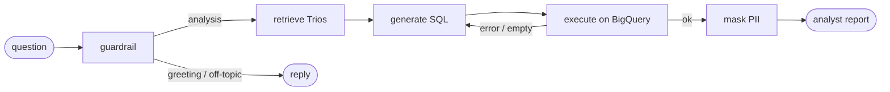

# Retail Data Agent

Conversational data-analysis agent for non-technical retail managers: ask about sales, products, customers, and orders in plain language, and get an analyst-grade report backed by **live BigQuery SQL**. The agent reuses past analyst examples (a "golden bucket"), masks PII, self-corrects bad queries, and adapts its tone to each user.

> Full design, diagrams, and a per-requirement deep dive:
> **[`docs/architecture.md`](docs/architecture.md)**.

## Pipeline



Built on **LangGraph + LangChain v1** as an explicit state graph; each node is a small, testable function, and the `execute → generate` edge is the self-correction loop.

## Highlights

- **Hybrid intelligence** — semantic retrieval of analyst *Trios* (Question → SQL → Report) from Qdrant, used as few-shot for SQL and report style.
- **Grounded text-to-SQL** — live schema + real column values (enums) profiled from BigQuery; a **dry run** validates syntax and caps scanned bytes before any billed query; one self-correction retry on error/empty.
- **PII-safe** — 4 layers (normalized column names, LLM-flagged columns, value regex, hard prompt rule); PII is masked on the result rows, never reaching output.
- **Comparative reasoning** — "why is X underperforming vs Y?" → one multi-metric query + a report that interprets likely causes (grounded, no invented numbers).
- **Per-user memory** — a structured profile (style + interests) consolidated by a reflection step and stored in a **LangGraph `Store`** (native long-term memory).
- **Personas** — report tone is editable YAML (`tone_of_voice` / `manners` / `length`), hot-reloaded with no redeploy.
- **Observability** — per-node JSONL traces, a per-turn metrics summary, a `--verbose` flow view, and optional LangSmith.
- **Provider-agnostic** — OpenAI / **Gemini** / OpenRouter via one `.env` switch, zero code changes (verified end-to-end on `gemini-2.5-flash`).

## Quickstart

```bash
# 1. Environment
python -m venv .venv && source .venv/bin/activate
pip install -r requirements.txt

# 2. Configure (do NOT overwrite an existing .env)
cp -n .env.example .env
#   set LLM_PROVIDER, LLM_MODEL, the matching API key, and GCP_PROJECT

# 3. BigQuery auth (Application Default Credentials)
gcloud auth application-default login

# 4. Seed the golden bucket (downloads a ~50 MB embedding model once)
python scripts/seed_golden_bucket.py

# 5. Chat
python -m src.cli --user vadim
```

Dataset: `bigquery-public-data.thelook_ecommerce` (read-only, public — free tier
covers it). No Docker required.

## Using the chat

```bash
python -m src.cli                 # default user
python -m src.cli --user vadim    # memory and context are per user
python -m src.cli --verbose       # show intent, retrieved Trios, SQL, and prompts
```

### Commands

| Command | What it does |
|---|---|
| `/help` | Show available commands |
| `/persona` | List available report personas |
| `/persona <name>` | Switch report tone without restarting the CLI |
| `/user <name>` | Switch user; learned memory is kept per user |
| `/memory` | Show the current user's learned answer style and interests |
| `/forget` | Clear the current user's learned memory |
| `/save` | Add the last successful answer as a new golden-bucket Trio |
| `/quit` or `/exit` | Exit the chat |

## Switching the LLM provider

One `.env` change, no code:

```ini
# OpenAI
LLM_PROVIDER=openai
LLM_MODEL=gpt-5.4-mini

# Google Gemini (free key from Google AI Studio)
LLM_PROVIDER=google_genai
LLM_MODEL=gemini-2.5-flash

# OpenRouter (one gateway to many models)
LLM_PROVIDER=openrouter
LLM_MODEL=openai/gpt-5.4-mini
```

The LLM layer is a thin `init_chat_model` factory, so structured output and the whole pipeline work identically across providers.

## Tests & evals

```bash
pytest -q                          # unit (PII) + offline end-to-end smoke
python scripts/eval_retrieval.py   # golden-bucket retrieval recall@k, MRR
```

## Observability

The CLI prints a run summary each turn; full per-node events go to
`logs/run_<id>.jsonl` (PII values are never logged).

Set `LANGSMITH_TRACING=true` + `LANGSMITH_API_KEY` in `.env` for full message-level traces at [smith.langchain.com](https://smith.langchain.com).

## Layout

```
src/
  graph.py            LangGraph assembly (nodes, edges self-correction loop)
  state.py            shared AgentState
  nodes/              guardrail, retrieve, generate_sql,execute_sql, mask_pii, report
  services/
    llm.py            provider-agnostic init_chat_model factory bigquery_client.py  adapter over bq_client: dict rows + live schema + enums + byte cap + dry-run
    golden_bucket.py  embedded Qdrant: Trio store / retrieval
    embeddings.py     fastembed embedder (behind an interface)
    memory.py         per-user memory on a LangGraph Store
    personas.py       report personas (tone)
    observability.py  structured logs, metrics, run summary
  data/seed_trios.json  golden dataset: 100 Trios with real figures
bq_client.py          reusable BigQuery runner (DataFrames)
config/personas.yaml  editable report tones (no redeploy)
scripts/              seed_golden_bucket, generate_trios, eval_retrieval
docs/architecture.md  diagrams + per-requirement design
```

## License

[MIT](LICENSE)
