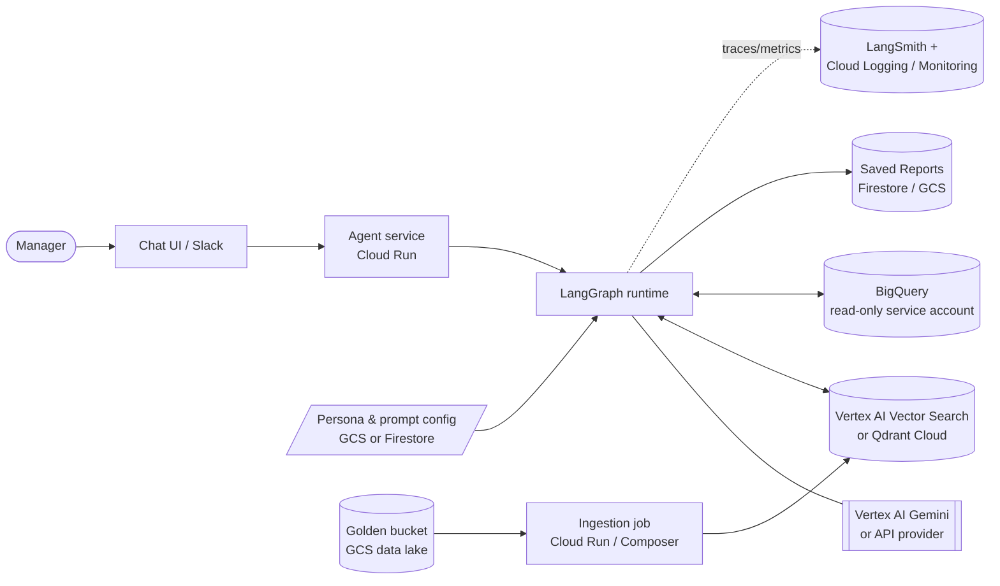

# Architecture & Technical Explanation

Internal data-analysis chat assistant for non-technical retail managers. A manager asks a question in plain language; the agent reuses past analyst knowledge, writes and runs SQL on BigQuery, masks PII, and answers with a short analyst report that the manager can keep discussing.

---

## 1. Scope and dataset

**LLM** — provider-agnostic via `.env` (`LLM_PROVIDER` / `LLM_MODEL`). Verified end-to-end on **OpenAI** and **Google Gemini `gemini-2.5-flash`** with no code changes; **OpenRouter** is also supported (one gateway to many models).

**Dataset** — `bigquery-public-data.thelook_ecommerce` (read-only; free tier). Tables used: `orders`, `order_items`, `products`, `users`. Capabilities the agent covers (per the assignment's "expected capabilities"):

- *Customer behaviour* — top customers by spend, repeat-buyer share, spend by segment.
- *Product performance* — revenue by category/brand/department, best sellers, margins.
- *Time-based metrics* — monthly/quarterly revenue, AOV, new customers over time.
- *Comparison & diagnosis* — "why is X underperforming vs Y?" (see Complex questions).
- *Database structure* — "what tables/columns exist?" (answered from live schema).

**What is implemented in code vs designed.**
This prototype implements PII Masking, Resilience, Observability, and (partly) QA — plus the non-optional Hybrid Intelligence, Learning Loop, and Agility.

---

## 2. High-level diagram

### Prototype (what runs in this repo)

```mermaid
flowchart TD
    user([Manager]) -->|question| cli[CLI chat - rich]
    cli --> graph

    subgraph graph[LangGraph agent]
        direction TB
        guard[guardrail] -->|allowed| retr[retrieve_trios]
        guard -->|blocked| done([refusal])
        retr --> gen[generate_sql]
        gen --> exec[execute_sql]
        exec -->|error / empty & retries left| gen
        exec -->|ok| mask[mask_pii]
        mask --> rep[report]
        rep --> ans([answer])
    end

    retr <--> qd[(Qdrant - embedded\ngolden bucket)]
    gen --- llm[[LLM via init_chat_model\nOpenAI / Gemini / OpenRouter]]
    rep --- llm
    guard --- llm
    exec <--> bq[(BigQuery\nthelook_ecommerce - read only)]
    rep --- persona[/personas.yaml + memory\nLangGraph Store/]

    graph -. per-node events .-> obs[(JSONL logs +\noptional LangSmith)]
```

### Production target (where each block maps on GCP)



---

## 3. Prototype components

| Block | Implementation | Why |
|---|---|---|
| Orchestration | LangGraph explicit state graph | Predictable, testable nodes; safety, masking, logging, and the self-correction cycle are explicit edges. |
| LLM access | LangChain `init_chat_model`, provider via `.env` | One factory for OpenAI, Gemini, and OpenRouter; structured output is used by guardrail, SQL generation, and memory. |
| Golden bucket | Embedded Qdrant local collection | Persistent vector search over analyst Trios without running an external service. |
| Embeddings | `fastembed` / `bge-small-en-v1.5` | Local 384-dim embeddings, behind an `Embedder` interface for later replacement. |
| Database | BigQuery public dataset via `BigQueryRunner` | Live SQL over the assigned dataset, with dry-run validation and a byte cap for cost control. |
| Persona / memory | `personas.yaml` + LangGraph `Store` hydrated from JSON | Tone can change without redeploy; user answer style and interests survive restarts. |
| Observability | JSONL run logs + CLI summary + optional LangSmith | Per-node traces, token/latency counters, SQL health, and safety metrics per turn. |

---

## 4. Data flow for one question

1. **guardrail** — an LLM classifies the message into one of three intents:
   *analysis* (continue the pipeline),
   *redirect* (anything benign but not analysis — greetings, thanks, off-topic like jokes → a friendly reply that steers back to the task, no SQL), or
   *blocked* (only critical cases: prompt-injection, requests for raw PII, harmful → a polite refusal).
   The intent is logged; only *analysis* proceeds. Hard blocks are reserved for dangerous requests; everything else is handled flexibly.
2. **retrieve_trios** — the question is embedded and the 3 most similar Trios (Question -> SQL -> Report) are pulled from Qdrant.
3. **generate_sql** — the LLM writes BigQuery SQL using the table schema (read live from BigQuery and cached, with a static fallback), **column values/enums** profiled live from BigQuery (cached), and the retrieved Trios as few-shot examples (which carry the join patterns). The same call also returns which output columns are PII.
   - *Good practice (not implemented here):* for larger schemas, add a curated **schema catalog + relationship map** as service config: which tables exist, what each table means, primary/business keys, and how tables join to each other. BigQuery does not declare foreign keys for this public dataset, so a human-maintained relationships file would improve join accuracy. In this prototype the model infers joins from the live schema, enums, and few-shot Trios, which is enough at this scale.
4. **execute_sql** — every generated SQL query is checked before execution: a free BigQuery **dry run** validates syntax and estimates scanned bytes against the cap; only then does the query run read-only with the same byte cap. On a dry-run failure (bad syntax / too expensive), a real-run error, or an empty result, the error is stored and the graph loops back to `generate_sql` once for a corrected query.
5. **mask_pii** — emails, phones, and PII-named columns are masked in the result rows, before anything is shown or sent back to the LLM.
6. **report** — the LLM writes the final report from the masked rows, using the active persona's tone, the user's layout preference, and past reports as style examples.

---

## 5. Complex, multi-step questions

The headline use case ("Why is branch X underperforming, and how does it compare to Y?") is two tasks: a **comparison** (pull metrics for X and Y across several angles) and a **diagnosis** (reason about why).

**In this prototype (single rich query + reasoning report):** `generate_sql` is told that comparative / "why" questions should produce *one* query that puts the metrics for the compared things side by side (group-by the dimension or conditional aggregation) across several angles — revenue, order count, AOV, return rate.

`report` is told to contrast the figures, highlight the biggest gaps, and suggest only reasons the data supports. This covers "compare X vs Y and explain" well, in one cheap, predictable pass.

**In production (planner sub-graph) — design:** for open-ended root-cause that needs several queries from different angles, add a router after `guardrail`:

```
guardrail → router ─ simple ─→ [generate_sql → execute_sql → mask_pii → report]
                   └ complex ─→ plan → (sub-query × N) → synthesize
```

- **plan** decomposes the question into sub-questions (revenue trend, returns, product mix, traffic … for X vs Y);
- each **sub-query** reuses the same generate→execute→mask nodes; results are collected (and PII-masked);
- **synthesize** reasons over all results to produce the diagnosis.

A ReAct / tool-calling agent (the model calls `run_sql` in a loop until it can answer) is the more flexible variant. Both cost more tokens and latency and are harder to evaluate, so the router keeps the cheap linear path for simple questions and only pays for planning when the question needs it.

---

## 6. Implementation

### Hybrid Intelligence (Golden Bucket)

**Providing relevant data at query time (retrieval).** This runs today:

1. The question is embedded (`fastembed` `bge-small-en-v1.5`, 384-dim, L2-normalized — `services/embeddings.py`).
2. Qdrant does a COSINE search for the top-3 nearest Trios(`GoldenBucket.retrieve`, node `retrieve_trios`).
3. The retrieved Trios feed the prompt: their **SQL** as few-shot for `generate_sql` ("how an analyst solved a similar question"), their **reports** as style examples for `report`.
4. In parallel the prompt gets **live BigQuery context**: schema (`get_schema`) and column values/enums (`get_enums`).

**Updating the bucket over time (learning loop).**

- *Prototype:* the golden bucket is a test fixture, not expert-authored knowledge: `generate_trios.py` created seed Trios grounded in real BigQuery numbers so retrieval, few-shot SQL generation, and reporting style could be tested. `/save` can add a just-answered question as a new Trio at runtime.
- *Production:* a scheduled ingestion pipeline (Cloud Run / Composer / Dataflow):
  ```
  new candidate -> validate -> dedupe -> embed question -> upsert to vector store
  ```
  - **Sources:** analyst-approved Trios landing in a GCS "golden" data lake (the real expert knowledge), plus agent sessions that got positive feedback (👍).
  - **Validation:** the SQL still runs (not broken by schema changes), the report is PII-free, the numbers reconcile.
  - **Quality gate:** only human-reviewed / highly-rated Trios are indexed; the rest are quarantined — so retrieval *improves* rather than drifts.
  - **Keyphrase indexing:** for larger or noisier buckets, extract 1-4 key phrases from each question during ingestion (for example "monthly revenue", "return rate by category", "top customers") and index them alongside the original question, either as extra vectors or metadata. At query time, extract the same kind of phrases from the user's question and search with both the full query and keyphrases. This improves exact business-term recall while the dense embedding still handles paraphrases.
  - **Dedupe:** by embedding similarity, to avoid near-duplicates.
  - **Maintenance:** each Trio carries provenance (author, date, rating, source); a periodic job re-runs stored SQL and archives ones broken by schema drift; changing the embedding model means re-embedding the whole collection (versioned).
  - **Avoid feedback loops:** agent outputs are never auto-indexed without review or a strong eval, so the system does not reinforce its own mistakes.

### Safety & PII Masking
- Masking happens on the **result rows** (`nodes/mask_pii.py`), not in the SQL, so even if the model selects a PII column the value never reaches the output.
- Four layers, so a miss in one is caught by another:
  1. **Normalized column names** — `email`, `e-mail`, `customer_email`, `contact_phone`, `street_address`, etc. are matched after normalization (so naming variants are covered); `product_name`/`category_name` stay visible.
  2. **LLM-flagged columns via Structured Output** — `generate_sql` returns `pii_columns` in the same structured-output call that produces SQL, so there is no extra LLM call. The `generate_sql` system prompt defines the sensitive categories to flag: emails, phones, full names, first/last names, and street addresses. This catches arbitrary aliases like `SELECT first_name AS x` that no name rule would.
  3. **Value regex as a narrow safety net** — emails and phones are redacted anywhere in free text. Regexes for addresses, names, and similar natural-language PII are unreliable, so the system does not depend on them as the primary detector.
  4. **Hard report prompt rule as last resort** — the report prompt says never to output PII, but this is a backup control only; the main protection is that rows are masked before the report LLM sees them.
- The **guardrail** node also refuses requests whose intent is to expose PII.
- Defence in depth: read-only DB + guardrail + masking (3 layers) + prompt rule. The masking functions are unit-tested (`tests/test_pii.py`).
- *Production add-ons:* move the sensitive category list out of the prompt into service-level configuration so teams can define PII classes centrally; add Cloud DLP API for richer detection (names/addresses), and column-level access policies in BigQuery so PII is never returned for most roles.

### High-Stakes Oversight (Destructive Ops) — *design only in this prototype*

The DB is read-only, but a production agent may own a **Saved Reports** library and support commands like "delete reports mentioning Client X" or "delete today's reports". That path needs per-user ownership plus a hard human-confirmation checkpoint.

Saved reports would store at least `report_id, owner_id, created_at, title, body|gcs_uri, client_mentions/text`. Every lookup is filtered by `owner_id == current user` from the session, never by a user-supplied owner. Prototype storage can be SQLite/JSON; production storage can be Firestore metadata plus GCS bodies.

**Delete flow:**
```
router → delete → resolve_filter → find_matches → CONFIRM(interrupt) → execute → respond
```
1. **resolve_filter** extracts `{scope: mentions | created_on | created_between | all_mine, client?, date?}`; relative dates like "today" are resolved in code.
2. **find_matches** queries only the current user's reports. Zero matches return immediately; ambiguous filters trigger a clarifying `interrupt()`.
3. **CONFIRM** uses LangGraph `interrupt()` to pause with a count and preview list ("Delete these 3 reports? yes/no"). The checkpointer holds state while waiting, so confirmation cannot be skipped and can survive restart with persistent storage.
4. **execute** runs only on explicit yes: soft-delete via `deleted_at`, keep records for N days for rollback, write an audit log, and make the operation idempotent.
5. **respond** reports the count and recovery window; large deletes should show a stronger warning before confirmation.

> Not to be confused with `/save`, which adds a Trio to the shared golden bucket (knowledge for everyone) — Saved Reports are personal artifacts per user.

### Continuous Improvement (Learning Loop)
- **User level (learned memory):** rather than explicit preference toggles, a periodic **reflection** (`services/memory.py`) reads the recent dialog window and keeps a small **structured profile** per user — a single `answer_style` line (format/length/tone) and a deduplicated `interests` list. Each run is a structured-output call that **consolidates** (keep / merge / drop / add) rather than appending, and reasons first (a `reasoning` field) to make better merge decisions — so the profile stays compact and non-redundant instead of piling up. It runs after each analysis turn (and on exit). The profile lives in a **LangGraph `Store`** (the framework's native long-term memory) under namespace `("memory",)` keyed by user; the `report` node reads it in-graph via `get_store()` and injects it into the prompt, so answers adapt to each manager over time. The store is an `InMemoryStore` hydrated from / persisted to `user_memory.json` so it survives restarts (a persistent `PostgresStore` would replace the file in production). `/memory` shows it, `/forget` clears it. Only general patterns are kept — no PII or raw actions.
- **System level:** good interactions become new Trios (see requirement 1). Production also feeds thumbs-up/down and eval scores back into which Trios are trusted, closing the loop.

### Resilience & Graceful Error Handling
- **Pre-validation (free):** before the real run, every generated SQL query goes through a BigQuery **dry run** (`validate_query`) that checks syntax and estimates bytes. Syntax errors are caught for free (no billed query), and over-budget queries are rejected with a clear message.
- **Self-correction retry:** dry-run failures, real-run errors, and empty results feed the error text back into `generate_sql`. The graph is bounded by `MAX_ATTEMPTS = 2`, meaning initial generation plus one correction retry, so costs do not balloon.
- **Cost guard:** the dry-run estimate plus `maximum_bytes_billed` cap the data a query can scan.
- **No crashes:** the CLI wraps each turn; any unexpected error is caught and shown as a message, and the chat continues.
- **3rd-party downtime:** LangChain retries transient API errors; the provider is swappable via env, so an outage can be routed to another provider/model.

*Production:* timeouts, circuit breakers, and a fallback model.

### Quality Assurance

**Implemented today.**
- *Unit:* `tests/test_pii.py` covers deterministic masking: normalized PII column names, free-text emails/phones, numeric aggregates whose aliases contain PII words, and LLM-flagged aliases.
- *Offline end-to-end:* `tests/test_smoke.py` runs the graph with fake LLM/BQ, proving wiring and PII masking without network/API keys.
- *Retrieval:* `scripts/eval_retrieval.py` measures recall@1, recall@3, and MRR on paraphrases. Current recall@3 is **100%** on 18 cases, so the right Trios reliably reach the prompt.
- *SQL validity:* runtime BigQuery dry runs validate syntax and cost; the same mechanism can prove stored golden-bucket SQL still executes after schema or prompt changes.

**Planned evaluation gates.**
- *Guardrail eval:* a labeled allowed/blocked set tracks precision/recall: do not block legitimate analytics questions, and do block PII, prompt-injection, and data-exfiltration requests.
- *Offline task set:* ~30-50 representative questions, each scored with:
  1. **SQL execution accuracy:** run generated SQL and compare result sets / numbers against a reference query, not SQL text, because equivalent SQL can differ. Dry-run first confirms validity and budget.
  2. **Faithfulness:** every figure in the report must appear in the result rows; ungrounded numbers are flagged.
  3. **Intent / relevance:** a separate LLM judge scores whether the report answers this question, is complete, includes key facts, and gives an actionable "so what".
- *Zero-PII check:* every eval output is scanned for sensitive information values; any leak blocks release.
- *CI thresholds:* deploys are blocked if SQL execution accuracy, recall@3, or judge score drops below target, or if any PII leak is detected.

**Online monitoring after deployment.** Use explicit 👍/👎 feedback, implicit signals such as users rephrasing the same question, dashboard alerts, and periodic human review of sampled sessions. Good sessions become candidate Trios only after review, so the system does not reinforce its own mistakes.

### Observability

**Metrics tracked per turn** (`RunObserver` / `RunMetrics` in `services/observability.py`), grouped:

- *Latency:* `total_ms` and `node_ms` (per node) — shows where time goes.
- *Cost / usage:* `llm_calls`, `input_tokens`, `output_tokens` (→ cost estimate).
- *SQL health:* `sql_attempts`, `sql_errors` (error rate), `empty_results`, plus the dry-run `scanned_bytes`.
- *Self-correction:* attempts > 1 means the agent auto-fixed a query.
- *Safety:* `pii_redactions`, `guardrail_blocked`.
- *Outcome:* `status` = ok / blocked / error.

Each node also writes a structured JSON line to `logs/run_<id>.jsonl`; one turn = one file, so failures can be reconstructed by intent, retrieved Trios, generated SQL, dry-run bytes, retries, errors, and redactions. Logs are PII-safe: row counts, redaction counts, and SQL are logged, but raw result rows are not.

LangSmith is optional and env-driven; when enabled, it adds message-level traces for LLM calls, while local JSONL remains the fallback.

**Production.** Structured logs → Cloud Logging; metrics → Cloud Monitoring dashboards and alerts for SQL error rate, empty-result spikes, p95 latency, guardrail-block spikes, cost spikes, and provider 5xx/timeouts. Incidents are sliced by `run_id` / `session_id` / `user`.

### Agility (Persona Management)

The CEO wants to change report tone weekly, with no developer involvement.

**How it works (today).**
- Tone lives in `config/personas.yaml`: an `active` key plus a `personas` map, each with structured fields a non-developer edits — `tone_of_voice` (how it sounds), `manners` (behaviour/formatting), and `length`. `load_persona()` composes them into the report prompt.
- `load_persona()` reads the file **on every turn** (no cache), so an edit applies to the very next question — **hot reload, no restart, no redeploy**.
- Persona behavior can be optimized by editing only `config/personas.yaml`: tighten the answer length, make the tone more executive or more conversational, change formatting manners, or add a new persona. Edits to the active persona are picked up by the next report automatically; a newly added persona is used after switching `active:` or running `/persona <name>`.
- The active persona is switched three ways: the `/persona <name>` chat command (`set_active_persona`, which rewrites only the `active:` line so the file's guiding comments survive), editing `active:` by hand, or programmatically.
- The `report` node injects `load_persona()` into the `{persona}` slot of its prompt. Adding a new persona is just another YAML block — no code.

**Production.**
- Move the config to a managed store (**Firestore / GCS**) behind a small **admin form**, so non-developers edit via UI, not raw YAML.
- **Versioning + audit:** keep the history of tone changes (who/when) to enable **rollback** if a weekly change misfires.
- **Validation** before save (length limits, reject prompt-injection in the instructions).
- **Propagation without redeploy:** short-TTL cache or pub/sub invalidation so all instances pick up the new tone quickly.
- **Scope:** personas per team/tenant; optional scheduling (change tone on a calendar).

*Note:* persona is hot-reloaded every turn, while the SQL context (schema/enums) is cached — deliberate: tone should change instantly, schema rarely changes.

---

## 7. Reasoning for the chosen services, models & frameworks

- **LangGraph instead of an open-ended ReAct agent:** text-to-SQL benefits from a predictable pipeline; safety, masking, logging, and the one retry loop are explicit graph nodes/edges.
- **Provider-agnostic LLM via `init_chat_model`:** OpenAI, Gemini, and OpenRouter share one factory and the same structured-output contract.
- **Qdrant embedded + fastembed:** the prototype runs without external vector infrastructure. Qdrant is a good fit for Trios because payloads are first-class, so the retrieved vector hit already contains the question, SQL, and report needed for few-shot prompting; metadata filters and Qdrant Cloud give a clean production path. Other embeddings could be used; fastembed was the simplest local implementation and can be replaced behind the existing interface.
- **BigQuery:** it is the target dataset, supports read-only access, and dry-run validation gives both syntax checking and byte estimates before execution.
